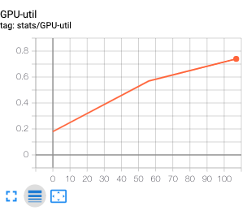

# monitor-gpu-util
script for monitoring gpu-utilization 

## requirements
* [GPUtil](https://github.com/anderskm/gputil) -> `pip install GPUtil`
* tensorboardX 

## why
I couldn't figure out a way to monitor the gpu utilization (in terms of %) while having a job running via slurm.
Using this script will create one background process that will monitor this metric and log it to your specified tensorboard directory.

## how to use it
simple:
in your `submit.sh` script add these lines before:
```
...


TENSORBOARDNAME="experiment1"
DEVICES="1,2"

set -e # will allow the monitor to be killed if main code fails, instead of exiting the .sh script

python monitor.py ${TENSORBOARDNAME} ${DEVICES} & 
MONITOR_PID=$!

python your_main_code.py ${TENSORBOARDNAME} || kill ${MONITOR_PID}

.... 
```
the script automatically kills itself after around 2h, which should be enough to understand if you need more CPU workers etc.


